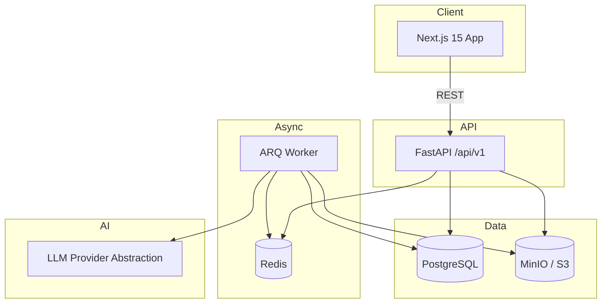

# Architecture

## Overview

ARA (AI Resume Analyzer) is a multi-tenant SaaS that accepts resume uploads, runs asynchronous AI analysis, and returns structured feedback (skills, gaps, score, suggestions).



## Monorepo structure

| Path | Responsibility |
|------|----------------|
| `apps/web` | UI, file upload UX, job status polling |
| `apps/api` | REST API, auth, orchestration |
| `apps/api/app/workers` | Background analysis jobs |
| `apps/api/app/llm` | Provider-agnostic LLM interface |
| `apps/api/app/storage` | S3/MinIO presigned URLs and object fetch |
| `packages/shared-types` | Shared TypeScript DTOs (sync with OpenAPI) |

## Request flows

### Resume upload (target)

1. Client requests presigned upload URL from `POST /api/v1/resumes/upload-url`.
2. Client uploads PDF/DOCX directly to MinIO.
3. Client confirms upload via `POST /api/v1/resumes/` with metadata.
4. API stores resume record scoped to `organization_id`.

### Analysis (target)

1. Client calls `POST /api/v1/analysis/jobs` with `resume_id`.
2. API creates `analysis_jobs` row (`pending`) and enqueues ARQ task.
3. Worker sets status → `processing`, fetches file from storage, extracts text.
4. Worker calls LLM via `app/llm` abstraction.
5. Worker persists `analysis_results` and sets status → `completed` (or `failed`).
6. Client polls `GET /api/v1/analysis/jobs/{id}` or subscribes via SSE (future).

## Data model

All tenant-owned records include `organization_id` for multi-tenancy.

| Table | Purpose |
|-------|---------|
| `organizations` | Tenant boundary |
| `users` | Authenticated users, belong to one org |
| `resumes` | File metadata + `storage_key` (not raw content in DB) |
| `analysis_jobs` | Async job lifecycle |
| `analysis_results` | Structured JSON output from LLM |

Primary keys are UUIDs. Job status enum: `pending | processing | completed | failed`.

## Backend layers

```
api/v1/endpoints/   → HTTP, validation, status codes
services/           → business rules, orchestration
repositories/       → database queries
models/             → SQLAlchemy ORM
schemas/            → Pydantic request/response DTOs
```

Endpoints currently return `501` — implement logic in services, not routers.

## Configuration

Single source of truth: `app/core/config.py` (`pydantic-settings`).

Environment variables are documented in `.env.example`. Never commit `.env`.

## Security (to implement)

- JWT auth on all tenant routes
- Row-level scoping by `organization_id`
- Presigned URLs with short TTL and content-type constraints
- File type/size validation before analysis
- Rate limiting via `slowapi` (configured in `main.py`)
- Prompt injection awareness when sending resume text to LLMs

## Infrastructure

### Local (Docker Compose)

| Service | Role |
|---------|------|
| `db` | PostgreSQL 16 with healthcheck |
| `redis` | Job queue + cache |
| `minio` | S3-compatible object storage |
| `api` | FastAPI with hot reload |
| `worker` | ARQ consumer |
| `web` | Next.js dev server |

### Production considerations

- Run API and worker as separate scalable deployments (same image, different command).
- Use managed PostgreSQL, Redis, and S3 (AWS S3, GCS, etc.).
- Put a reverse proxy (nginx, Traefik, cloud LB) in front of web + API.
- Run `alembic upgrade head` as a deploy step.
- Enable structured logging + OpenTelemetry.
- Store secrets in a vault or cloud secret manager.

## Frontend

- **App Router** (`app/`) — not Pages Router.
- **Tailwind v4** — CSS-first config in `app/globals.css`.
- **shadcn/ui** — `components/ui/`, add components via CLI when needed.
- **API client** — `lib/api-client.ts` uses `NEXT_PUBLIC_API_URL`.

Generate TypeScript types from OpenAPI when the API stabilizes:

```sh
# Example (after API is running)
npx openapi-typescript http://localhost:8000/openapi.json -o packages/shared-types/src/generated.ts
```

## CI (`.github/workflows/ci.yml`)

- Lint and typecheck frontend packages
- Ruff + pytest for API
- Build Docker images on main branch

## Scaling

- **API**: horizontal replicas behind load balancer (stateless).
- **Worker**: scale ARQ workers independently based on queue depth.
- **Database**: read replicas for reporting; connection pooling via PgBouncer at scale.
- **Storage**: object storage scales independently.

## PII and data retention

Resumes contain personal data. Plan for:

- Encryption at rest (S3 SSE, encrypted Postgres volumes)
- Retention policies and user-initiated deletion
- Audit logging for access to resume objects
- GDPR/CCPA compliance workflows as needed
